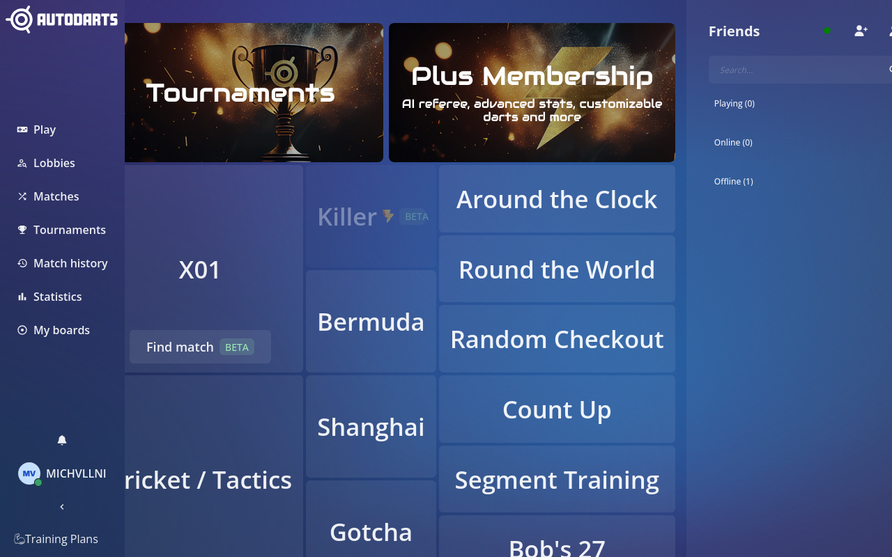
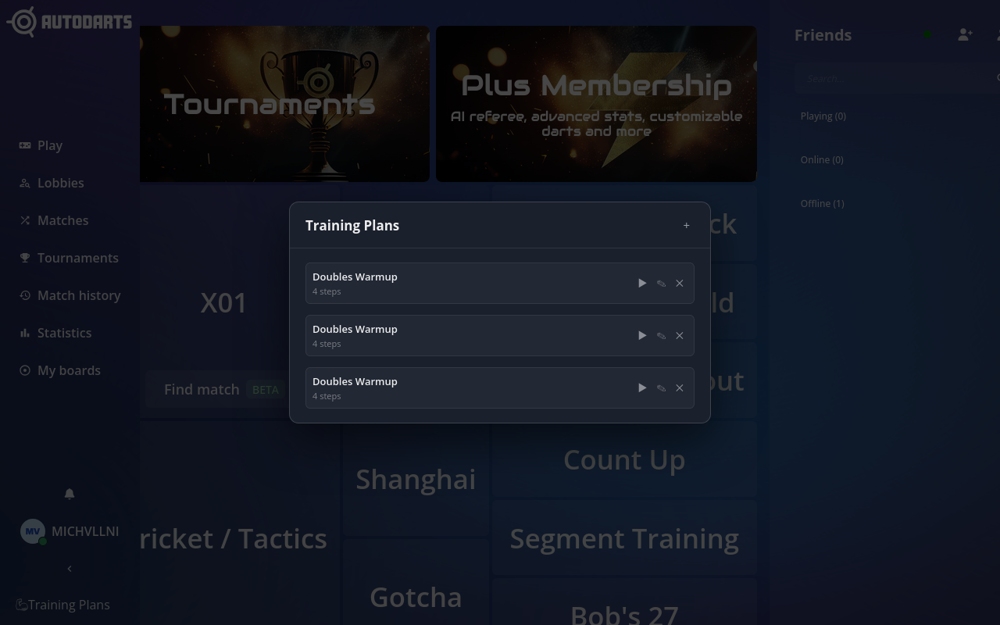
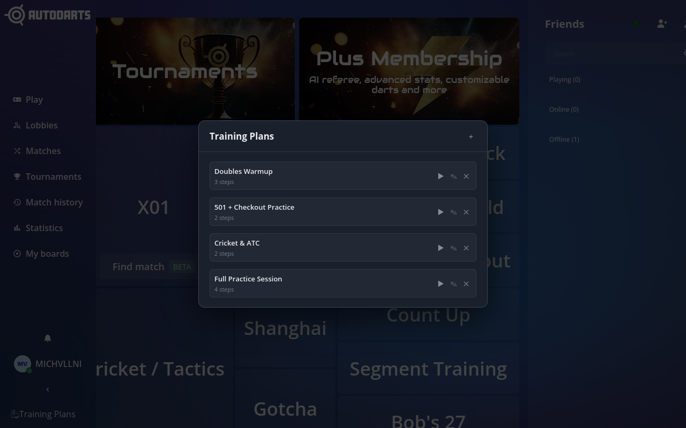
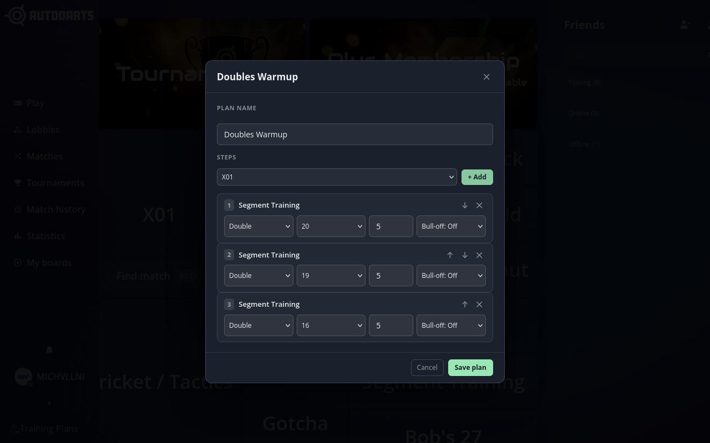
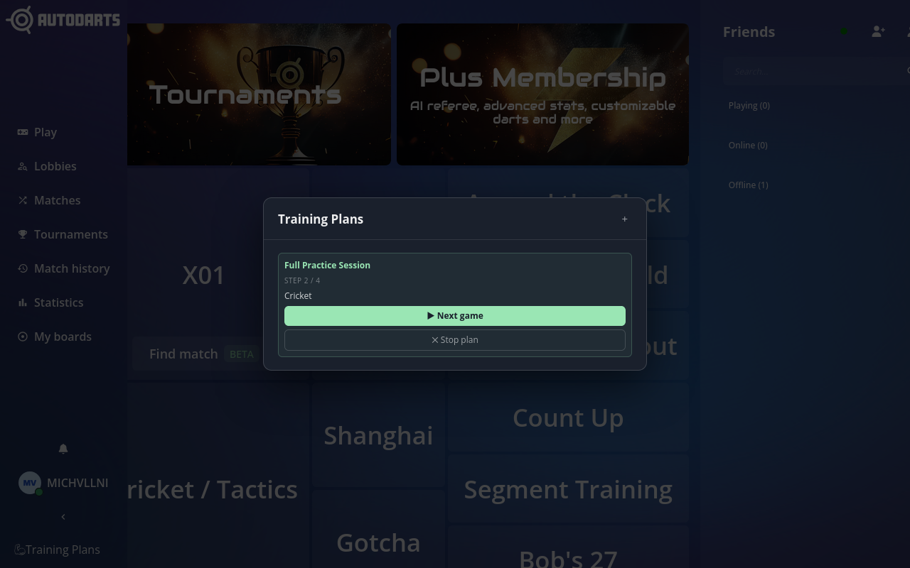

# Autodarts Training Plans

A browser extension for [play.autodarts.io](https://play.autodarts.io) that lets you build and run structured training sessions. Define an ordered list of games across any variant, and the extension creates each private lobby automatically — you just click **Start game**.

---

## Screenshots

| | |
|---|---|
|  |  |
|  |  |
|  | |

---

## Features

- **Training plans** — create named plans with as many steps as you like, each step being any supported game variant with full settings control
- **Auto-lobby** — the extension calls the Autodarts API to create a private lobby and joins it automatically; you only press Start game
- **11 game variants** — X01, Cricket / Tactics, ATC, Segment Training, Bob's 27, Bermuda, Gotcha, Shanghai, RTW, Random Checkout, Count Up
- **Per-user storage** — plans are stored in `localStorage` scoped to your Autodarts account; multiple users on the same browser stay independent
- **Session persistence** — an active plan survives page navigation and picks back up after each game ends
- **No account or server** — everything runs locally; the only network traffic is to `autodarts.io` itself

---

## Installation

### From release zip (recommended)

1. Download `autodarts-training-chrome.zip` (Chrome) or `autodarts-training-firefox.zip` (Firefox) from the [Releases](../../releases) page.

**Chrome / Chromium / Edge**

2. Unzip to a permanent folder.
3. Open `chrome://extensions`, enable **Developer mode**, click **Load unpacked**, and select the unzipped folder.

**Firefox**

2. Open `about:debugging#/runtime/this-firefox`, click **Load Temporary Add-on**, and select the `.zip` file directly.  
   For a permanent install, the extension must be signed by Mozilla or loaded via `about:config` (`xpinstall.signatures.required = false`).

### Build from source

```bash
git clone https://github.com/YOUR_USERNAME/browser-extension-autodarts-training
cd browser-extension-autodarts-training
npm install
npm test        # 25 tests
bash build.sh   # produces dist/chrome/ dist/firefox/ and .zip packages
```

Then load `dist/chrome/` or `dist/firefox/` as an unpacked extension as above.

---

## Usage

1. Navigate to [play.autodarts.io](https://play.autodarts.io) and log in.
2. Click **Training Plans** in the left sidebar.
3. Press **+** to create a new plan, give it a name, and add steps using the variant picker.
4. Click **▶** to start the plan — the first lobby is created automatically.
5. After each game the extension detects the URL change and prompts **▶ Next game** to continue, or **✕ Stop plan** to end the session.

---

## Supported Variants & Settings

| Variant | Key settings |
|---|---|
| X01 | Base score (121–901), in/out mode (Straight / Double / Master), bull mode, max rounds |
| Cricket / Tactics | Game mode (Cricket / Tactics), scoring mode (Standard / CutThroat / NoScore), max rounds |
| ATC | Mode (Full / Single / Double / Triple / OuterSingle), order, hits per segment |
| Segment Training | Mode, segment (1–20, Bull), required hits |
| Bob's 27 | Mode (Normal / AllowNegativeScore), order |
| Bermuda | *(no settings)* |
| Gotcha | Target score, out mode, max rounds |
| Shanghai | Order (1–20) |
| RTW | Order |
| Random Checkout | Score range, out mode, max rounds |
| Count Up | Max rounds |

---

## Browser Support

| Browser | Manifest | Min version |
|---|---|---|
| Chrome / Chromium / Edge | MV3 | Chrome 88+ |
| Firefox | MV2 | Firefox 109+ |

---

## Privacy

All data (training plans, active session) is stored exclusively in your browser's `localStorage` and `sessionStorage`. No data is sent to any third-party server. The extension communicates only with `play.autodarts.io` and `api.autodarts.io`.

---

## Development

```
src/
  content.js          — main content script (token capture, UI, API calls)
  content.css         — styles matching the Autodarts dark theme
  injected.js         — Firefox page-world script for XHR interception
  manifest.chrome.json
  manifest.firefox.json
  icons/
tests/
  content.test.js     — Jest + jsdom, 25 tests
build.sh              — builds dist/chrome/ and dist/firefox/ + zip packages
```

Run tests:

```bash
npm test
```

Build release packages:

```bash
bash build.sh
```

---

## License

[Mozilla Public License 2.0](LICENSE)
